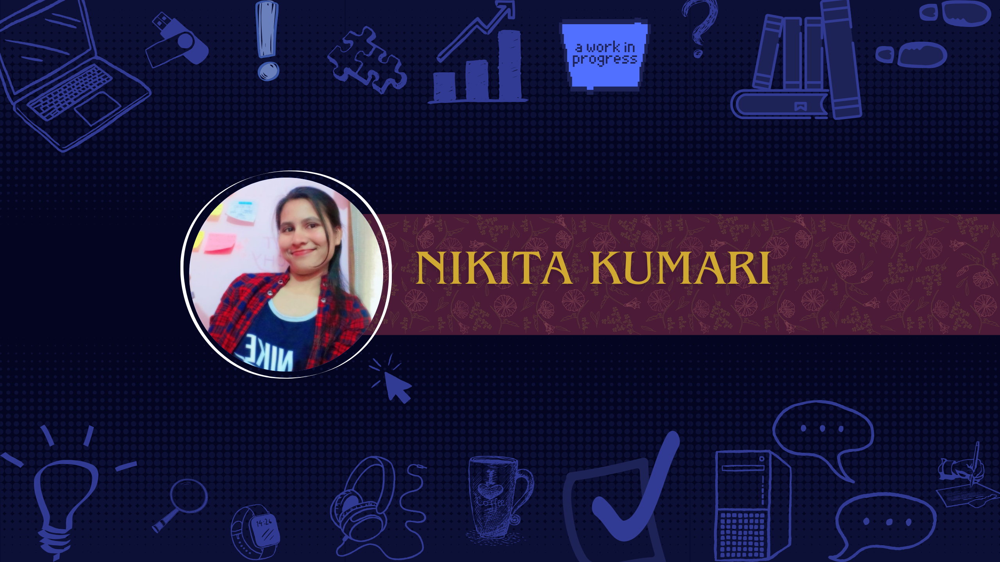

  

<h1 align="center">Hi, I'm Nikita Kumari 👋</h1>

  Computer Science student • DevOps & Cloud fundamentals

  

---

## 🚀 What I’m Building

- ☁️ **30 Days AWS Challenge**  
  Hands-on AWS learning with real workflows and clear documentation  
  → [Walkthrough Demo](https://www.linkedin.com/posts/nikita-k-302613240_aws-amazonwebservices-iam-activity-7396011764154286080-WID7)

- 📘 **DSA Patterns Playbook**  
  Structured problem-solving patterns with explanations and examples  
  → *(Repo link here)*

---

## About

CS major focused on **problem-solving depth** and **cloud fundamentals**.  
I learn by building, documenting, and publishing my work publicly to stay consistent.

No buzzwords. Only proof.

---

## Current Focus

- Data Structures & Algorithms (patterns, not brute force)
- AWS core services: EC2, S3, IAM, basic CI/CD
- Writing clear explanations for future reference
- Building in public (GitHub & LinkedIn)

---

## Tech Stack

**Languages**: C++, Java, Python  
**Core**: Data Structures & Algorithms  
**Cloud**: AWS (EC2, S3, IAM, CodeDeploy, CI/CD basics)  
**Tools**: Git, GitHub, Linux, Docker

---

## 📜 LeetCode

- 🔗 [LeetCode Profile](https://leetcode.com/u/nikita_kumari_101/)
- 💻 Primary Language: C++

  

---

## Connect

- GitHub: https://github.com/Nikita1kum  
- LinkedIn: https://www.linkedin.com/in/nikita-k-302613240/

---
## Language Usage

  
  

  Consistency beats intensity.

